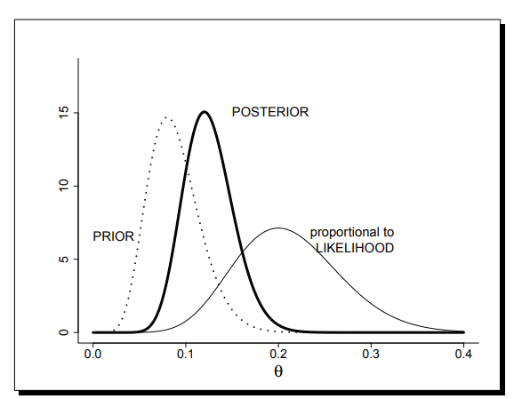

## Introduction

This is an R notebook about Bayesian Inference. Let's start with an example. We are conducting a study on heart strokes. Historical studies show complication SICH. We want to estimate risk for SICH in ECASS 3. We have prior informations from two studies : ECASS 1 and ECASS 2, ECASS 2 says proportion of patients with SICH is $8/100$.

The first preliminary results, in ECASS 3, tell us that out of 50 patients with strokes, 10 are affected by the SICH complication.

### Notation : 
 
* SICH incidence : $\theta$
* i.i.d Bernouilli rvs : $y_1,...,y_n$
* SICH : $y_1 = 1$, 0 otherwise.
* $y = \sum^{n}_{i=1} y_i \sim Bin(n,\theta)$
* $p(y|\theta) = {N\choose\theta} \theta^y (1-\theta)^{n-y}$

## The Frequentist paradigm

Let's get back for a moment to the good old frequentist paradigm. In this paradigm, we do not use any prior informations (asymptotic goes brrrr). For a binomially distributed random variable, the MLE for $\theta$ is obtained from the likelihood function : 
$$ \hat{\theta} = \arg\max_\theta \left[ \left[ \prod_i^n {{N}\choose{y_i}} \right] \theta^{\sum_1^n y_i} (1-\theta)^{nN - \sum_1^n{y_i}}\right] $$

Which yiels an MLE of :
$$ \hat{\theta} = \frac{\bar{y}}{N}  $$
Trivially, number of successes on total number of trials is the MLE estimator of theta for a binomially distributed random variable. Hence, in our exemple with only 10 patients with SICH out of 50 patients with stroke, theta hat is 
$$ \hat{\theta} = 1/5 $$
ECASS 2 study claimed that the proportion of patients with SICH was 0.09. Let's construct a $95 \%$ CI for the MLE we obtained. We know that :

$$ \sqrt{n}\left(\hat{\theta}-\theta_0\right) \rightarrow \mathcal{N}\left(0,\frac{1}{\mathcal{I}_1(\theta_0)}\right)$$
And that $\mathcal{I}_1(\theta_0)$ is the Fisher information which is equal to $\frac{n}{\theta(1-\theta)} $

Therefore, in this example, the Fisher information is :
$$\mathcal{I}_1(\theta_0) = \frac{50}{0.2 \times 0.8}$$
Thus a 95 \% confidence interval can be found whose upper and lowers are bounds are :
$$ +/- \frac{1.96}  {\sqrt n \times \mathcal{I}_1(\hat{\theta}) }$$
Here, this corresponds to 0.2 +/- 0.1568. The assumption of normality on which this rely is often violated. Likelihood approach. We can also use the Wald method is preferred :
$$ \hat{\theta} +/- z \sqrt \frac{\hat{\theta}(1-\hat{\theta})}{n} $$
This produces a confidence interval of 0.2 +/- 0.11

## Bayesian approach

In the Bayesian approach, we _use_ prior information. We start by : 

* Specifying the (ECASS 2) prior distribution
* Constructing the posterior distribution
* Characteristics of the posterior distribution
* Equivalence of prior information and extra data

### Specifying the prior distribution
Okay kids, let's start with the likelihood function we've shown earlier :
$$ L(\theta|y_0) = {n_0\choose y_0} \theta^{y_0} (1-\theta)^{n_0-y_0} $$
Although this function does provide valuable information about the likelihood of a parameter theta having  _prior_ belief theta (because y_0 and n_0 can be from a prior study), this likelihood function is obviously not a pdf. Indeed, its integral from -Inf to +Inf is not equal to 1.

Because of the second likelihood principle :
" _Two likelihood functions for θ contain the same information about θ if they
are proportional to each other_ "
We basically just have to standardize this likelihood function. This standardization can be done numerically or analytically.

In the specific case of a binomial likelihood function, this is proportional to a beta density $Beta(\alpha,\beta)$ :

$$ p(\theta) = \frac{1}{B(\alpha_0,\beta_0)} \theta^{\alpha_0-1} (1-\theta)^{\beta_0-1} $$
With $\alpha_0 = 9$ and  $\beta_0 = 100 - 8 + 1$.

Bayes Theorem is : 

$$ p(\theta|\pmb{y}) = \frac{L(\theta|\pmb{y})p(\theta)}{p(\pmb{y})}  $$
In this case, the posterior probability is the likelihood $L(\theta|\pmb{y})$ multiplied by prior theta divided by the averaged likelihood.

This all leads to :
$$ p(\theta|y) = \frac{1}{B(\bar{\alpha}\bar{\beta)}} \theta^{\bar{\alpha}-1}(1-\theta)^{\bar{\beta}-1} $$



```{r}

```
